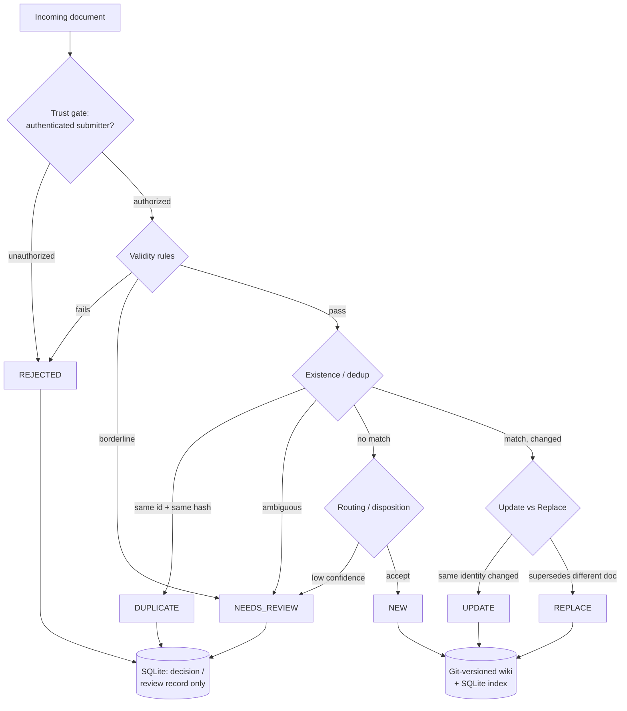

# llmwiki

**An LLM that maintains a wiki, not a retriever that re-reads the world on every query.**

`llmwiki` is a backend implementing Karpathy's **LLM Wiki** pattern: instead of re-discovering knowledge per query like RAG, an LLM incrementally builds and maintains a persistent, git-versioned markdown wiki, so knowledge accumulates instead of being re-derived each time. v1 builds only the ingest side, because the hard part isn't reading the wiki — it's deciding what to write.

## The core idea: ingest as a composable rule pipeline

Every incoming document has to earn its place. Given a doc, the engine picks one outcome:

| Outcome | Meaning |
|---|---|
| **NEW** | No match — a genuinely new doc. |
| **UPDATE** | Same identity, content changed — a new version. |
| **DUPLICATE** | Same identity and same content hash — no-op. |
| **REPLACE** | Supersedes a *different* existing doc (archive + link, never hard-delete). |
| **NEEDS_REVIEW** | Ambiguous or borderline — queued for a human. |
| **REJECTED** | Failed trust, or dropped as non-knowledge (small talk, PII, chit-chat). |

That logic is not hard-coded. It's a data-driven, admin-composable framework:

- A pipeline is an **ordered list of gates**; each gate holds rules drawn from a library of configurable rule types.
- Rule categories: **Validity**, **Existence/Duplication**, **Update vs Replace**, **Routing/Disposition**.
- Evaluation is **ordered, first-match, short-circuit**, with a shared context that carries findings between rules.
- **Deterministic rules** handle the obvious cases for free (length, denylist, exact hash, similarity score ranges). **Semantic rules** (`knowledge_worthiness`, `semantic_duplicate`, `semantic_replace`) call the LLM only in the uncertain middle range, turning scores and confidence into a disposition.

Two safety principles are built in:

- **Asymmetric caution** — a wrong UPDATE silently overwrites a distinct doc and is hard to detect, while a wrong NEW just leaves a recoverable near-duplicate. So on uncertainty, never auto-UPDATE; fall back to NEEDS_REVIEW or NEW.
- **Fail safe** — provider/embedding failures never produce a guessed mutation; they route to review or surface an error, never a silent store or overwrite.

Trust is identity-based (authenticated submitter → principal → per-collection authorization), not content-based. No PKI, no LLM scoring whether content "looks legit."

## Ingest flow



Only **NEW / UPDATE / REPLACE** write the git wiki. DUPLICATE and REJECTED persist only a decision record; NEEDS_REVIEW persists a decision record plus a review-queue item. Wiki writes are atomic (git commit first, then version row). Idempotent retries are handled via an optional `idempotency_key` field in the ingest request body, looked up in the decisions table. Ingest is serialized per collection for consistent state; different collections run in parallel.

## Platform

- **Realms = zones = collections** — a **collection** is the isolation unit (its own git repo, index scope, and gate pipeline). `collection` is the term used in code and API paths (`/v1/collections/{c}`); "realm"/"zone" are the same thing, used as the admin-UI label.
- **Scoped API keys** — each key is a principal with roles (`ingest` / `read` / `query` / `reviewer` / `admin`), scoped to specific realms or `*`. Only SHA-256 hashes are stored; the raw key is shown once.
- **Query** — brute-force cosine over active versions (reusing ingest embeddings), per-collection (`POST /v1/collections/{c}/query`) or global across allowed realms (`POST /v1/query`).
- **Admin UI** at `/admin` — realms, review queue, key management, and a visual gate builder (order gates and rule rows; param inputs generated from each rule's schema; raw JSON under "Advanced"). A minimal per-collection review dashboard is also available at `/dashboard/{collection}`.
- **REST + MCP over one shared core** — both interfaces produce identical decisions (contract-tested).
- **Storage** — files + git as the wiki (`sources/` + `wiki/` + `index.md` + `log.md`); SQLite as the index. No external services required.
- **Pluggable LLM provider** — a deterministic `FakeProvider` for offline dev/tests, and `LiteLLMProvider` for real models (`embed` / `adjudicate` / `assess`), which needs the relevant provider credentials in your environment.

## Status

Built and tested (131 tests passing):

- The composable gate & rule framework (11 rule types, ordered first-match engine, a default pipeline reproducing prior behavior, REPLACE disposition).
- Realms & scoped API keys (DB-persisted principals, roles, key management).
- Query API (per-collection + global) plus an MCP query tool.
- Admin UI with the visual gate builder.

**Next:** SP-A — pluggable BYO storage (Postgres + pgvector for HA / multi-writer and a real vector index, replacing the default local SQLite + git store).

> Out of scope for now: the query-time synthesis and lint phases of the full LLM-Wiki vision. This project builds the write path first.

## Requirements

Python 3.11+. No external services required for the default setup.

## Quickstart

```bash
python -m venv .venv && .venv/bin/pip install -e ".[dev]"

# Start the server (offline "fake" provider, admin dev-key)
LLMWIKI_API_KEY=dev-key .venv/bin/llmwiki serve &

# Wait until it's listening
until curl -sf localhost:8000/healthz >/dev/null; do sleep 0.3; done

# Create a collection
curl -s localhost:8000/v1/collections -H "authorization: Bearer dev-key" \
  -H 'content-type: application/json' -d '{"name":"kb"}'

# Ingest a document
curl -s localhost:8000/v1/collections/kb/documents -H "authorization: Bearer dev-key" \
  -H 'content-type: application/json' \
  -d '{"content":"The enterprise refund window is thirty days from invoice.","declared_id":"d1"}'
```

Expected outcomes:

- First ingest of `d1` → `{"outcome":"NEW"}`
- Resubmitting the same content → `{"outcome":"DUPLICATE"}`
- Ingesting `"hi thanks"` → `{"outcome":"REJECTED"}`

Admin UI: <http://localhost:8000/admin> (log in with the admin key). Run tests with `.venv/bin/pytest -q`.
